# MiniTorch Module 3


* Docs: https://minitorch.github.io/

* Overview: https://minitorch.github.io/module3.html


You will need to modify `tensor_functions.py` slightly in this assignment.

* Tests:

```
python run_tests.py
```

* Note:

Several of the tests for this assignment will only run if you are on a GPU machine and will not
run on github's test infrastructure. Please follow the instructions to setup up a colab machine
to run these tests.

This assignment requires the following files from the previous assignments. You can get these by running

```bash
python sync_previous_module.py previous-module-dir current-module-dir
```

The files that will be synced are:

        minitorch/tensor_data.py minitorch/tensor_functions.py minitorch/tensor_ops.py minitorch/operators.py minitorch/scalar.py minitorch/scalar_functions.py minitorch/module.py minitorch/autodiff.py minitorch/module.py project/run_manual.py project/run_scalar.py project/run_tensor.py minitorch/operators.py minitorch/module.py minitorch/autodiff.py minitorch/tensor.py minitorch/datasets.py minitorch/testing.py minitorch/optim.py


Task 3_1, 3_2

```
MAP

================================================================================
 Parallel Accelerator Optimizing:  Function tensor_map.<locals>._map,
D:\cs5781\mod3-Dariyn\minitorch\fast_ops.py (172)
================================================================================


Parallel loop listing for  Function tensor_map.<locals>._map, D:\cs5781\mod3-Dariyn\minitorch\fast_ops.py (172)
------------------------------------------------------------------------------------------------------|loop #ID
    def _map(                                                                                         |
        out: Storage,                                                                                 |
        out_shape: Shape,                                                                             |
        out_strides: Strides,                                                                         |
        in_storage: Storage,                                                                          |
        in_shape: Shape,                                                                              |
        in_strides: Strides,                                                                          |
    ) -> None:                                                                                        |
        if np.array_equal(in_strides, out_strides) and np.array_equal(                                |
            in_shape, out_shape                                                                       |
        ):                                                                                            |
            for i in prange(--------------------------------------------------------------------------| #0
                len(out)                                                                              |
            ):  # Parallel loop over all elements in the output tensor.                               |
                out[i] = fn(                                                                          |
                    in_storage[i]                                                                     |
                )  # Directly apply the function `fn` to the input element.                           |
                                                                                                      |
        else:                                                                                         |
            for i in prange(--------------------------------------------------------------------------| #1
                len(out)                                                                              |
            ):  # Parallel loop over all elements in the output tensor.                               |
                # Create index arrays for navigating the output and input tensors.                    |
                out_index: Index = np.empty(MAX_DIMS, dtype=np.int32)                                 |
                in_index: Index = np.empty(MAX_DIMS, dtype=np.int32)                                  |
                                                                                                      |
                # Convert flat output index into a multidimensional index.                            |
                to_index(i, out_shape, out_index)                                                     |
                                                                                                      |
                # Compute the corresponding input index using broadcasting rules.                     |
                broadcast_index(out_index, out_shape, in_shape, in_index)                             |
                                                                                                      |
                # Translate multidimensional indices to positions in flat storage.                    |
                o = index_to_position(out_index, out_strides)  # Output position.                     |
                j = index_to_position(in_index, in_strides)  # Input position.                        |
                                                                                                      |
                # Apply the function `fn` to the input element and store the result in the output.    |
                out[o] = fn(in_storage[j])                                                            |
--------------------------------- Fusing loops ---------------------------------
Attempting fusion of parallel loops (combines loops with similar properties)...
Following the attempted fusion of parallel for-loops there are 2 parallel for-
loop(s) (originating from loops labelled: #0, #1).
--------------------------------------------------------------------------------
----------------------------- Before Optimisation ------------------------------
--------------------------------------------------------------------------------
------------------------------ After Optimisation ------------------------------
Parallel structure is already optimal.
--------------------------------------------------------------------------------
--------------------------------------------------------------------------------

---------------------------Loop invariant code motion---------------------------
Allocation hoisting:
The memory allocation derived from the instruction at
D:\cs5781\mod3-Dariyn\minitorch\fast_ops.py (195) is hoisted out of the parallel
 loop labelled #1 (it will be performed before the loop is executed and reused
inside the loop):
   Allocation:: out_index: Index = np.empty(MAX_DIMS, dtype=np.int32)
    - numpy.empty() is used for the allocation.
The memory allocation derived from the instruction at
D:\cs5781\mod3-Dariyn\minitorch\fast_ops.py (196) is hoisted out of the parallel
 loop labelled #1 (it will be performed before the loop is executed and reused
inside the loop):
   Allocation:: in_index: Index = np.empty(MAX_DIMS, dtype=np.int32)
    - numpy.empty() is used for the allocation.
None
ZIP

================================================================================
 Parallel Accelerator Optimizing:  Function tensor_zip.<locals>._zip,
D:\cs5781\mod3-Dariyn\minitorch\fast_ops.py (237)
================================================================================


Parallel loop listing for  Function tensor_zip.<locals>._zip, D:\cs5781\mod3-Dariyn\minitorch\fast_ops.py (237)
-----------------------------------------------------------------------------------------|loop #ID
    def _zip(                                                                            |
        out: Storage,                                                                    |
        out_shape: Shape,                                                                |
        out_strides: Strides,                                                            |
        a_storage: Storage,                                                              |
        a_shape: Shape,                                                                  |
        a_strides: Strides,                                                              |
        b_storage: Storage,                                                              |
        b_shape: Shape,                                                                  |
        b_strides: Strides,                                                              |
    ) -> None:                                                                           |
        if (                                                                             |
            np.array_equal(a_strides, b_strides)                                         |
            and np.array_equal(a_strides, out_strides)                                   |
            and np.array_equal(a_shape, b_shape)                                         |
            and np.array_equal(a_shape, out_shape)                                       |
        ):                                                                               |
            for i in prange(len(out)):  # Parallel loop over all output elements.--------| #2
                out[i] = fn(a_storage[i], b_storage[i])  # Apply function directly.      |
                                                                                         |
        else:                                                                            |
            for i in prange(len(out)):  # Parallel loop over all output elements.--------| #3
                # Create index arrays for output and input tensors.                      |
                out_index: Index = np.empty(MAX_DIMS, dtype=np.int32)                    |
                a_index: Index = np.empty(MAX_DIMS, dtype=np.int32)                      |
                b_index: Index = np.empty(MAX_DIMS, dtype=np.int32)                      |
                                                                                         |
                # Convert flat output index into a multidimensional index.               |
                to_index(i, out_shape, out_index)                                        |
                                                                                         |
                # Compute corresponding indices for A and B using broadcasting rules.    |
                broadcast_index(out_index, out_shape, a_shape, a_index)                  |
                broadcast_index(out_index, out_shape, b_shape, b_index)                  |
                                                                                         |
                # Convert multidimensional indices to positions in flat storage.         |
                o = index_to_position(out_index, out_strides)                            |
                j = index_to_position(a_index, a_strides)                                |
                k = index_to_position(b_index, b_strides)                                |
                                                                                         |
                # Apply the function `fn` and store the result in the output tensor.     |
                out[o] = fn(a_storage[j], b_storage[k])                                  |
--------------------------------- Fusing loops ---------------------------------
Attempting fusion of parallel loops (combines loops with similar properties)...
Following the attempted fusion of parallel for-loops there are 2 parallel for-
loop(s) (originating from loops labelled: #2, #3).
--------------------------------------------------------------------------------
----------------------------- Before Optimisation ------------------------------
--------------------------------------------------------------------------------
------------------------------ After Optimisation ------------------------------
Parallel structure is already optimal.
--------------------------------------------------------------------------------
--------------------------------------------------------------------------------

---------------------------Loop invariant code motion---------------------------
Allocation hoisting:
The memory allocation derived from the instruction at
D:\cs5781\mod3-Dariyn\minitorch\fast_ops.py (260) is hoisted out of the parallel
 loop labelled #3 (it will be performed before the loop is executed and reused
inside the loop):
   Allocation:: out_index: Index = np.empty(MAX_DIMS, dtype=np.int32)
    - numpy.empty() is used for the allocation.
The memory allocation derived from the instruction at
D:\cs5781\mod3-Dariyn\minitorch\fast_ops.py (261) is hoisted out of the parallel
 loop labelled #3 (it will be performed before the loop is executed and reused
inside the loop):
   Allocation:: a_index: Index = np.empty(MAX_DIMS, dtype=np.int32)
    - numpy.empty() is used for the allocation.
The memory allocation derived from the instruction at
D:\cs5781\mod3-Dariyn\minitorch\fast_ops.py (262) is hoisted out of the parallel
 loop labelled #3 (it will be performed before the loop is executed and reused
inside the loop):
   Allocation:: b_index: Index = np.empty(MAX_DIMS, dtype=np.int32)
    - numpy.empty() is used for the allocation.
None
REDUCE

================================================================================
 Parallel Accelerator Optimizing:  Function tensor_reduce.<locals>._reduce,
D:\cs5781\mod3-Dariyn\minitorch\fast_ops.py (303)
================================================================================


Parallel loop listing for  Function tensor_reduce.<locals>._reduce, D:\cs5781\mod3-Dariyn\minitorch\fast_ops.py (303)
-----------------------------------------------------------------------------------------|loop #ID
    def _reduce(                                                                         |
        out: Storage,                                                                    |
        out_shape: Shape,                                                                |
        out_strides: Strides,                                                            |
        a_storage: Storage,                                                              |
        a_shape: Shape,                                                                  |
        a_strides: Strides,                                                              |
        reduce_dim: int,                                                                 |
    ) -> None:                                                                           |
        # Parallel loop over all output positions.                                       |
        for i in prange(len(out)):-------------------------------------------------------| #4
            out_index: Index = np.empty(MAX_DIMS, dtype=np.int32)                        |
            # Convert the flat output index `i` to a multi-dimensional index.            |
            to_index(i, out_shape, out_index)                                            |
                                                                                         |
            # Compute the output position in the flat storage.                           |
            o = index_to_position(out_index, out_strides)                                |
                                                                                         |
            # Compute the input position corresponding to the output position.           |
            j = index_to_position(out_index, a_strides)                                  |
                                                                                         |
            # Initialize the accumulator with the current value in the output tensor.    |
            acc = out[o]                                                                 |
                                                                                         |
            # Compute the stride step along the reduction dimension.                     |
            step = a_strides[reduce_dim]                                                 |
                                                                                         |
            # Iterate over the reduction dimension and accumulate results.               |
            for _ in range(a_shape[reduce_dim]):                                         |
                acc = fn(acc, a_storage[j])  # Apply the reduction function.             |
                j += step  # Move to the next element in the reduction dimension.        |
                                                                                         |
            # Store the accumulated result back into the output tensor.                  |
            out[o] = acc                                                                 |
--------------------------------- Fusing loops ---------------------------------
Attempting fusion of parallel loops (combines loops with similar properties)...
Following the attempted fusion of parallel for-loops there are 1 parallel for-
loop(s) (originating from loops labelled: #4).
--------------------------------------------------------------------------------
----------------------------- Before Optimisation ------------------------------
--------------------------------------------------------------------------------
------------------------------ After Optimisation ------------------------------
Parallel structure is already optimal.
--------------------------------------------------------------------------------
--------------------------------------------------------------------------------

---------------------------Loop invariant code motion---------------------------
Allocation hoisting:
The memory allocation derived from the instruction at
D:\cs5781\mod3-Dariyn\minitorch\fast_ops.py (314) is hoisted out of the parallel
 loop labelled #4 (it will be performed before the loop is executed and reused
inside the loop):
   Allocation:: out_index: Index = np.empty(MAX_DIMS, dtype=np.int32)
    - numpy.empty() is used for the allocation.
None
MATRIX MULTIPLY

================================================================================
 Parallel Accelerator Optimizing:  Function _tensor_matrix_multiply,
D:\cs5781\mod3-Dariyn\minitorch\fast_ops.py (341)
================================================================================


Parallel loop listing for  Function _tensor_matrix_multiply, D:\cs5781\mod3-Dariyn\minitorch\fast_ops.py (341)
--------------------------------------------------------------------------------------------------|loop #ID
def _tensor_matrix_multiply(                                                                      |
    out: Storage,                                                                                 |
    out_shape: Shape,                                                                             |
    out_strides: Strides,                                                                         |
    a_storage: Storage,                                                                           |
    a_shape: Shape,                                                                               |
    a_strides: Strides,                                                                           |
    b_storage: Storage,                                                                           |
    b_shape: Shape,                                                                               |
    b_strides: Strides,                                                                           |
) -> None:                                                                                        |
    """NUMBA tensor matrix multiply function.                                                     |
                                                                                                  |
    Should work for any tensor shapes that broadcast as long as                                   |
                                                                                                  |
    ```                                                                                           |
    assert a_shape[-1] == b_shape[-2]                                                             |
    ```                                                                                           |
                                                                                                  |
    Optimizations:                                                                                |
                                                                                                  |
    * Outer loop in parallel                                                                      |
    * No index buffers or function calls                                                          |
    * Inner loop should have no global writes, 1 multiply.                                        |
                                                                                                  |
                                                                                                  |
    Args:                                                                                         |
    ----                                                                                          |
        out (Storage): storage for `out` tensor                                                   |
        out_shape (Shape): shape for `out` tensor                                                 |
        out_strides (Strides): strides for `out` tensor                                           |
        a_storage (Storage): storage for `a` tensor                                               |
        a_shape (Shape): shape for `a` tensor                                                     |
        a_strides (Strides): strides for `a` tensor                                               |
        b_storage (Storage): storage for `b` tensor                                               |
        b_shape (Shape): shape for `b` tensor                                                     |
        b_strides (Strides): strides for `b` tensor                                               |
                                                                                                  |
    Returns:                                                                                      |
    -------                                                                                       |
        None : Fills in `out`                                                                     |
                                                                                                  |
    """                                                                                           |
    a_batch_stride = a_strides[0] if a_shape[0] > 1 else 0                                        |
    b_batch_stride = b_strides[0] if b_shape[0] > 1 else 0                                        |
                                                                                                  |
    # Ensure dimensions are compatible for matrix multiplication.                                 |
    assert a_shape[-1] == b_shape[-2]                                                             |
                                                                                                  |
    # Outer loop over the batch dimension (parallelized).                                         |
    for batch in prange(out_shape[0]):------------------------------------------------------------| #5
        # Loop over the rows (j) and columns (i) of the output matrix.                            |
        for i in range(out_shape[-2]):  # Column index in the output matrix.                      |
            for j in range(out_shape[-1]):  # Row index in the output matrix.                     |
                # Compute the starting positions for the current row of `a` and column of `b`.    |
                a_pos = batch * a_batch_stride + i * a_strides[-2]                                |
                b_pos = batch * b_batch_stride + j * b_strides[-1]                                |
                                                                                                  |
                # Initialize the accumulator for the dot product.                                 |
                acc = 0.0                                                                         |
                                                                                                  |
                # Reduction loop over the shared dimension.                                       |
                for _ in range(a_shape[-1]):                                                      |
                    acc += (                                                                      |
                        a_storage[a_pos] * b_storage[b_pos]                                       |
                    )  # Dot product accumulation.                                                |
                    a_pos += a_strides[                                                           |
                        -1                                                                        |
                    ]  # Move to the next element in the current row of `a`.                      |
                    b_pos += b_strides[                                                           |
                        -2                                                                        |
                    ]  # Move to the next element in the current column of `b`.                   |
                                                                                                  |
                # Compute the position in the output tensor and store the result.                 |
                o = i * out_strides[-2] + j * out_strides[-1] + batch * out_strides[0]            |
                out[o] = acc  # Store the accumulated value.                                      |
--------------------------------- Fusing loops ---------------------------------
Attempting fusion of parallel loops (combines loops with similar properties)...
Following the attempted fusion of parallel for-loops there are 1 parallel for-
loop(s) (originating from loops labelled: #5).
--------------------------------------------------------------------------------
----------------------------- Before Optimisation ------------------------------
--------------------------------------------------------------------------------
------------------------------ After Optimisation ------------------------------
Parallel structure is already optimal.
--------------------------------------------------------------------------------
--------------------------------------------------------------------------------

---------------------------Loop invariant code motion---------------------------
Allocation hoisting:
No allocation hoisting found
None
```

Task 3.4
We can see that GPU does indeed run faster for larger matrices

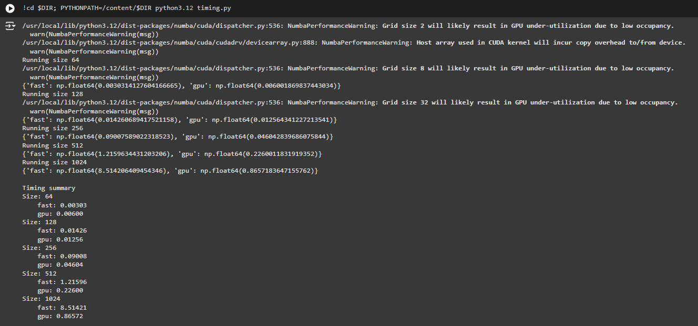

Graph

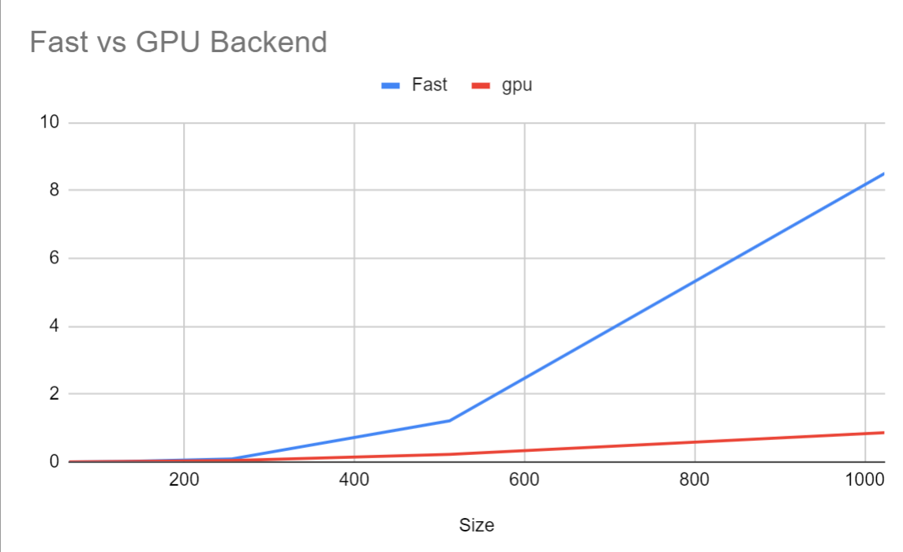


Task 3.5 - Hidden size = 100
Split gpu

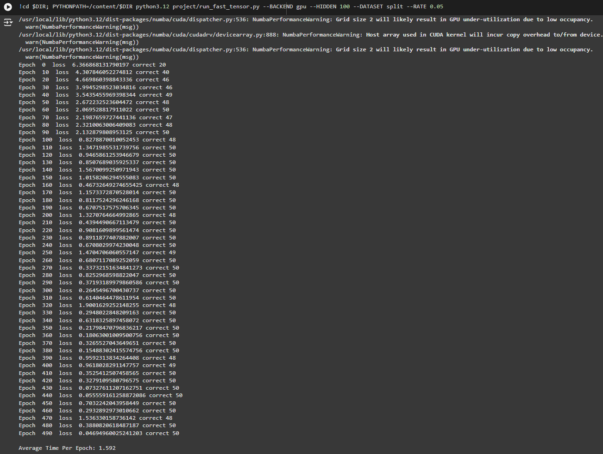

Split cpu

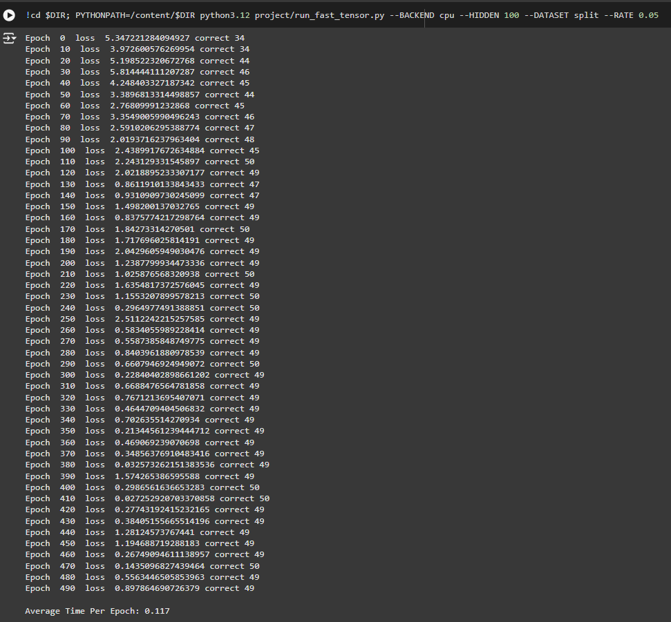

Simple gpu

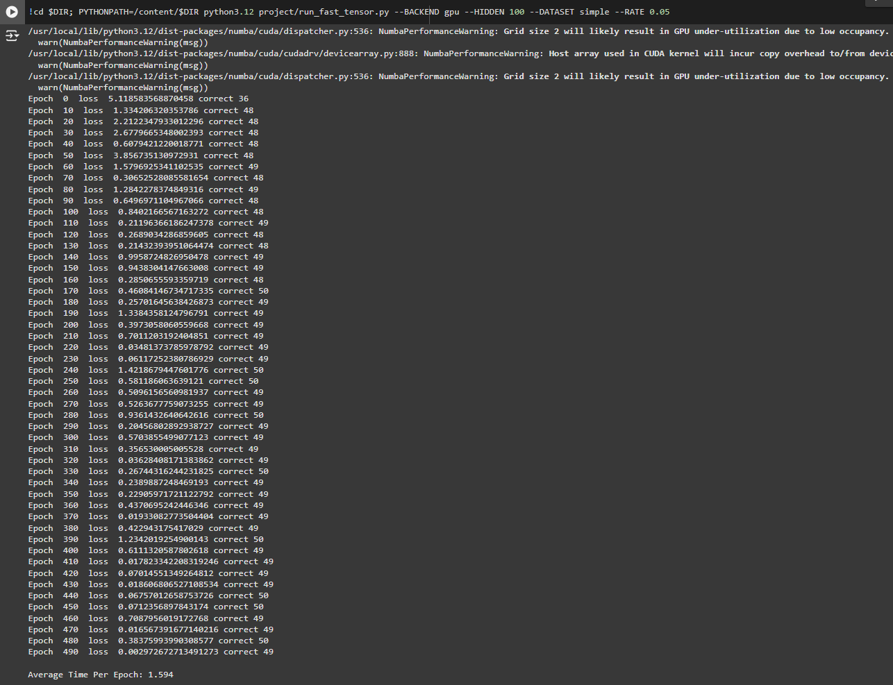

Simple cpu

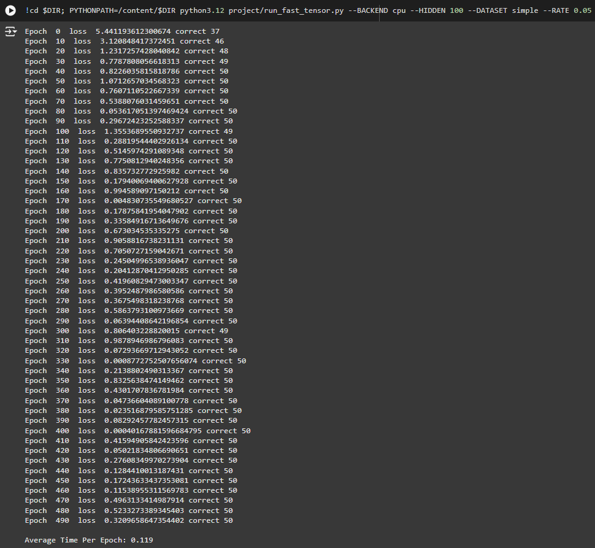

Xor gpu

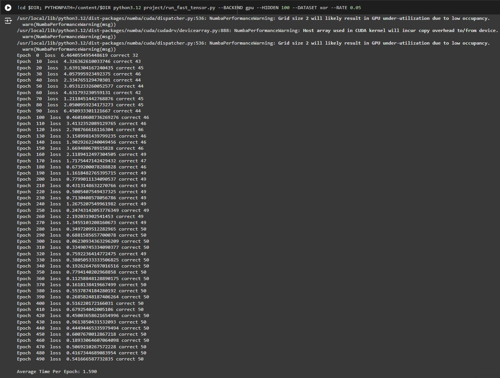

Xor cpu

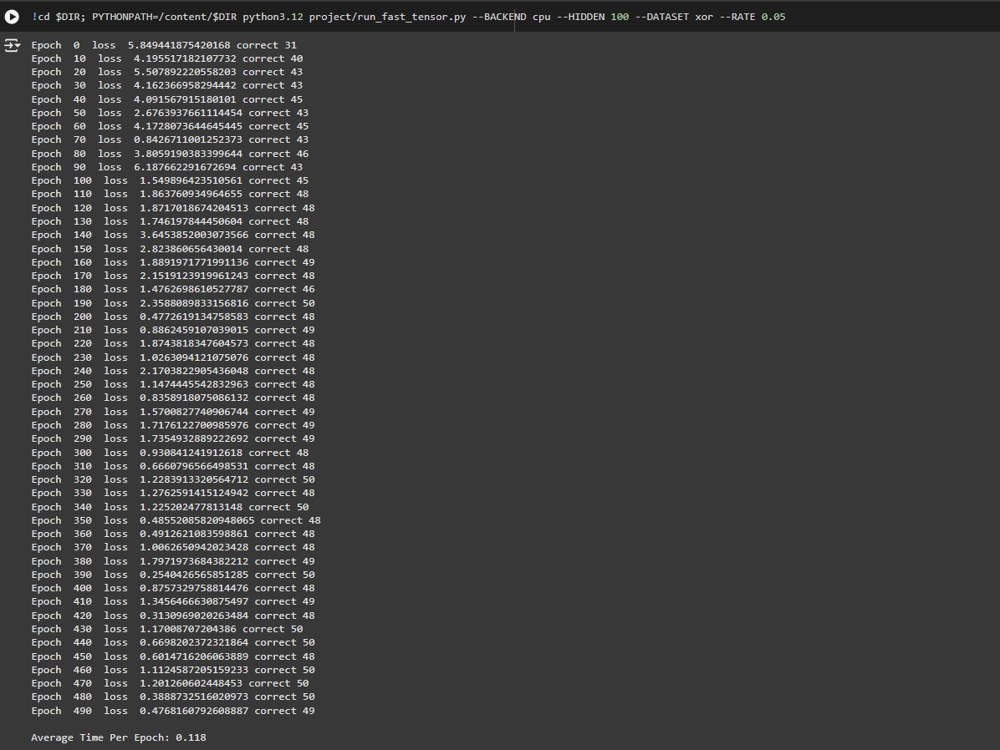

Task 3.5 - Hidden size = 200

Split gpu

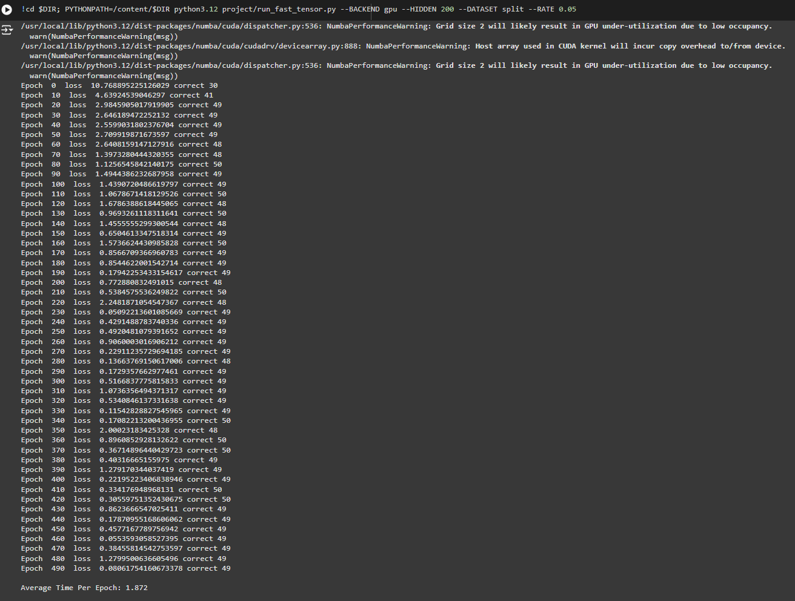

Split cpu

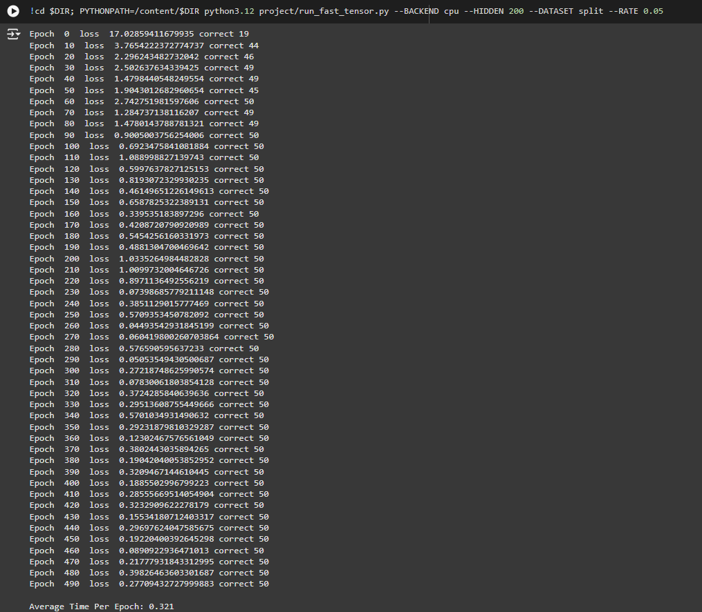

Simple gpu

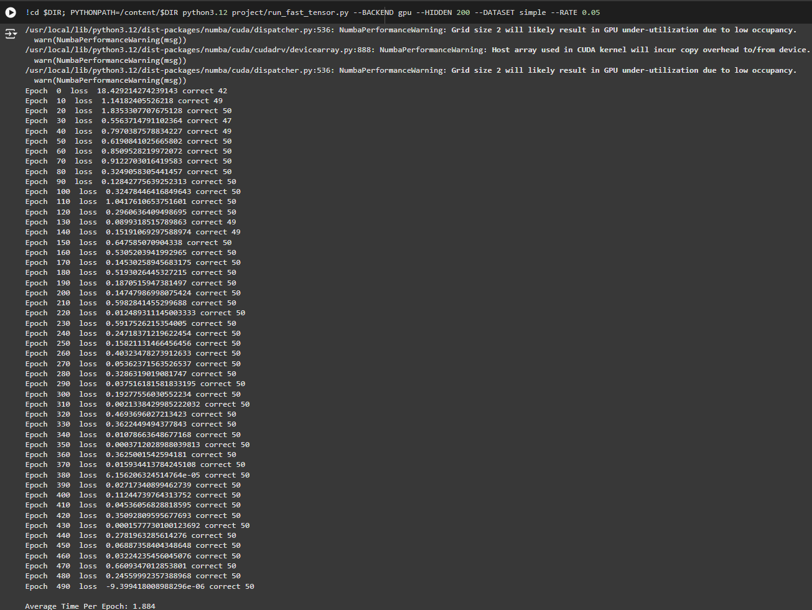

Simple cpu

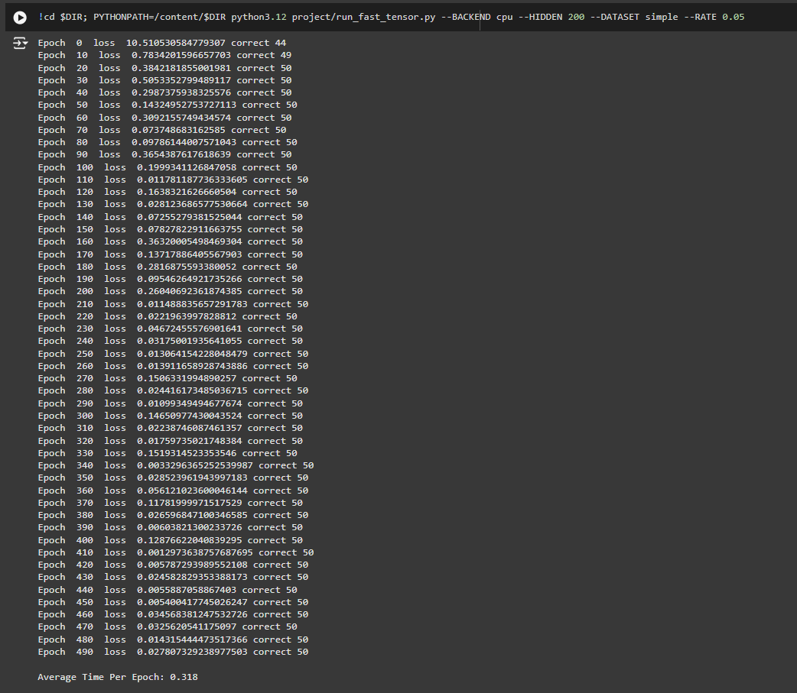

Xor gpu


Xor cpu

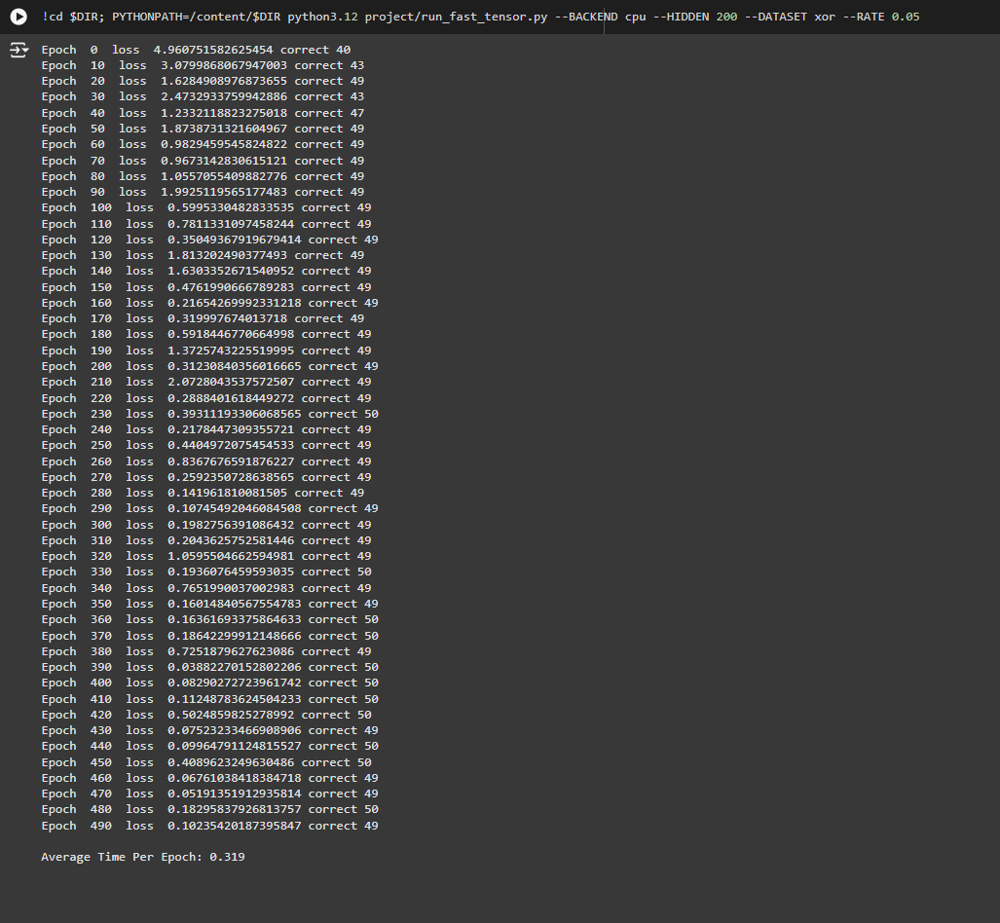